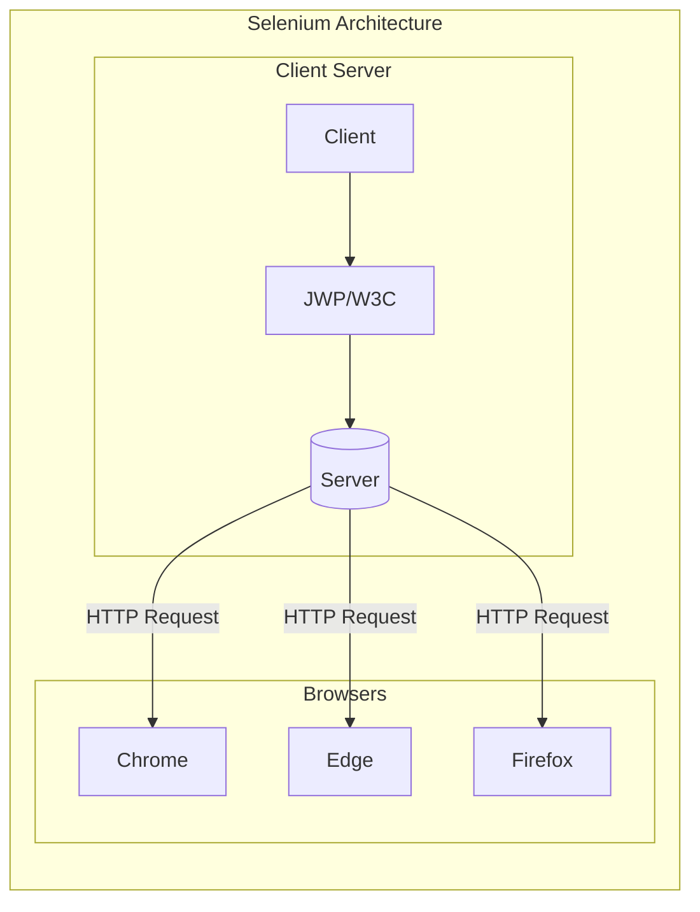
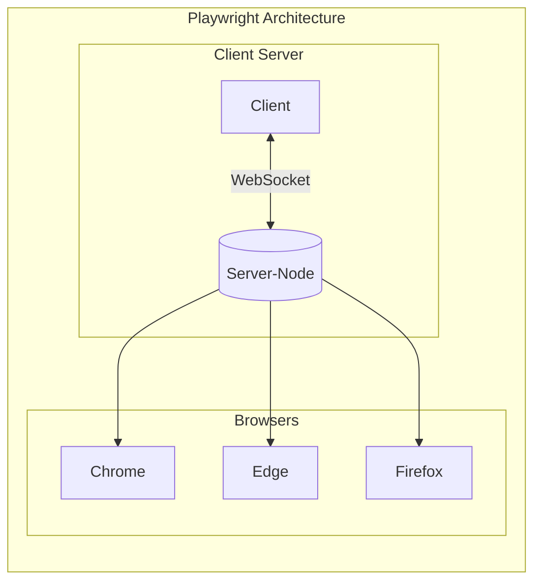

## Playwright-with-Java
Playwright Framework with Java on Eclipse

## Why Playwright
    CodeGen
    MultiLanguage Support
    Testing Safari on Windows
    Emulated Devices
    Test Retries
    Aggressive Releases
    Fixing Issues
    Allure Report
    Generate PDF

## Understanding Playwright Architecture
We know that people are used to Selenium Architecture where the communication used to happen via HTTP Request. When we say HTTP Request, that means that for each request the communication is unidirectional i.e. client to server or vice versa.



But the architecture of the playwright is not the same as Selenium, It's not based on an HTTP connection but on a WebSocket Connection. A WebSocket connection is a type of connection that is based on a handshaking mechanism i.e. when the request is sent from a client to the Server, both the client and server acknowledge the request tunneling is maintained and bidirectional communication can now take place between the client and server. It allows the session to be maintained until the connection is either closed from the client or Server. So once the server is up and running, one can send multiple requests at a time without login every time, unlike Selenium where a new login is maintained per each request.


    
## Installation
There are multiple ways to generate the binary codes for different browsers.
	1. Using MVN Package
		One way is to directly run the code from the eclipse, it will download all the binaries under AppData\Local\ms-playwright
		prior running the script and could be seen on the console.
	2. Using cmd
		Navigate to the project folder and run the below command, it will download all the binaries under AppData\Local\ms-playwright
    	mvn exec:java -e -D exec.mainClass=com.microsoft.playwright.CLI -D exec.args="install"

## Running a simple script
	
	Playwright playwright = Playwright.create();
	Browser browser = playwright.webkit().launch(new BrowserType.LaunchOptions().setHeadless(false));
	Page page = browser.newPage();
	page.navigate("https://www.amazon.com");
	String title = page.title();
	System.out.println("Page Title is " + title);
	String url = page.url();
	System.out.println("URL is " + url);
	browser.close();
	playwright.close();


## Debugging a Script
Add an environment variable under Run Configuration for any script:
	
	PWDEBUG : 1

or use 
	
	page.pause()

### CodeGen
CodeGen is a feature from Playwright to record and play and generate a script,Enter the below command(ensure maven is installed)

	mvn exec:java -e -D exec.mainClass=com.microsoft.playwright.CLI -D exec.args="codegen <<WebSite URL>>"
Copy the script generated inside the playwright inspector and use it.

### Trace Viewer
TraceViewer is a beautiful feature from Playwright to record the traces like meta data, console logs, api, Action Before and After,etc. Its a unique feature that helps in debugging or capturing details w.r.t. to a workflow or test script.
Once the traces are executed, trace.zip is created that could be seen either in he following manner
1. Using browser
 	Drop your trace file here: https://trace.playwright.dev/
2. Using cmd

	mvn exec:java -e -D exec.mainClass=com.microsoft.playwright.CLI -D exec.args="show-trace trace.zip"

### BrowserContext
BrowserContext allows user to open multiple sessions of a browser i.e. browser context inside a single test.


### Locators
There are few built in locators from Playwright and are recommended to use:

		Page.getByRole() to locate by explicit and implicit accessibility attributes.
		Page.getByText() to locate by text content.
		Page.getByLabel() to locate a form control by associated label's text.
		Page.getByPlaceholder() to locate an input by placeholder.
		Page.getByAltText() to locate an element, usually image, by its text alternative.
		Page.getByTitle() to locate an element by its title attribute.
		Page.getByTestId() to locate an element based on its data-testid attribute (other attributes can be configured).

##  Relative Locators
        
        right-of
        left-of
        above
        below
        near
        near,200
## Nth locator
        >> nth = 0
        >> nth = -1
        
### Using Chrome Dev Tools for Playwright Inspector
When it comes to validate the xpath, the first thing any QA would do it to open the Dev Tools and validate the xpath, css, etc. But when you are working with Playwright, there are couple of inbuilt locators that doesn't work with Dev Tools.
In such case, Do follow the below steps:
	
	1. Run Codegen for the website where you want to inspect element.
	2. Go to Dev Tool on the launched Browser.
	3. Start using playwright inbuilt commands under Console. For ex. playwright.$(<locator>)

## Automation Framework

```mermaid
flowchart LR    
        subgraph POM Model with Hybrid Framework
            direction LR
            id1[(1.TestClass)] -->2.BaseClass-->3.PlaywrightFactory -->4.Config.properties         
        
            direction LR
            id1[(1.TestClass)] --> 5.PageLayer 
            id1[(1.TestClass)] --> 6.Utils -->7.TestData
            id1[(1.TestClass)] --> 8.Reporting 
            id1[(1.TestClass)] --> GIT -->CI/CD
        end
 ```   


## Reference
	https://playwright.dev/java/docs/intro
	
