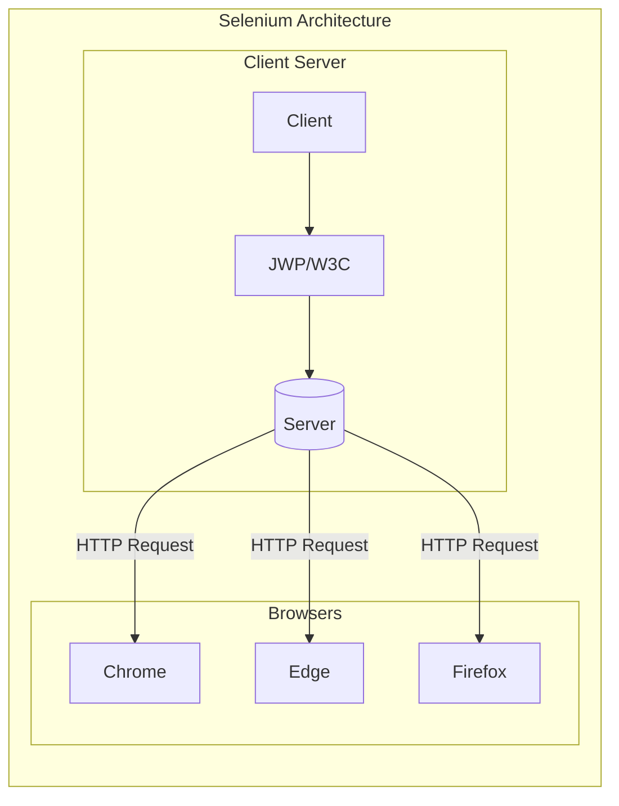
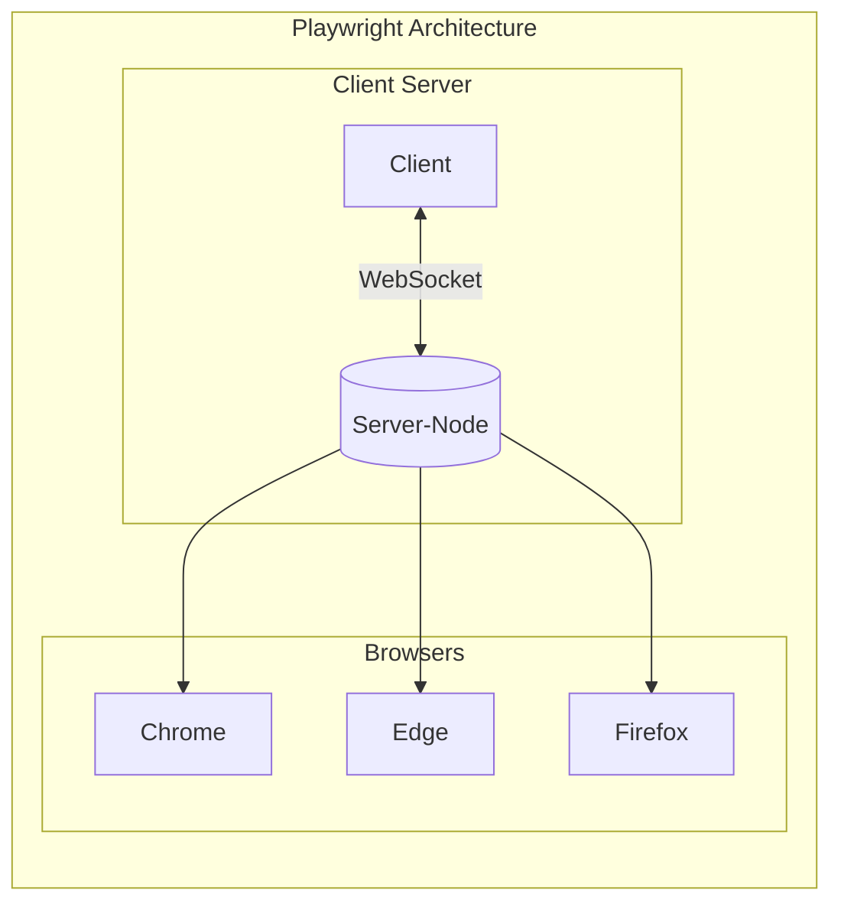

## Playwright-with-Java
Playwright Framework with Java on Eclipse

## Why Playwright
    CodeGen
    MultiLanguage Support
    Testing Safari on Windows
    Emulated Devices
    Test Retries
    Aggressive Releases
    Fixing Issues
    Allure Report
    Generate PDF

## Understanding Playwright Architecture
We know that people are used to Selenium Architecture where the communication used to happen via HTTP Request. When we say HTTP Request, that means that for each request the communication is unidirectional i.e. client to server or vice versa.

But the architecture of the playwright is not the same as Selenium, It's not based on an HTTP connection but on a WebSocket Connection. A WebSocket connection is a type of connection that is based on a handshaking mechanism i.e. when the request is sent
from a client to the Server, both the client and server acknowledge the request tunneling is maintained and bidirectional communication can now take place between the client and server. It allows the session to be maintained until the connection is either closed from the client or Server. So once the server is up and running, one can send multiple requests at a time without login every time, unlike Selenium where a new login is maintained per each request.

    
